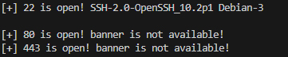
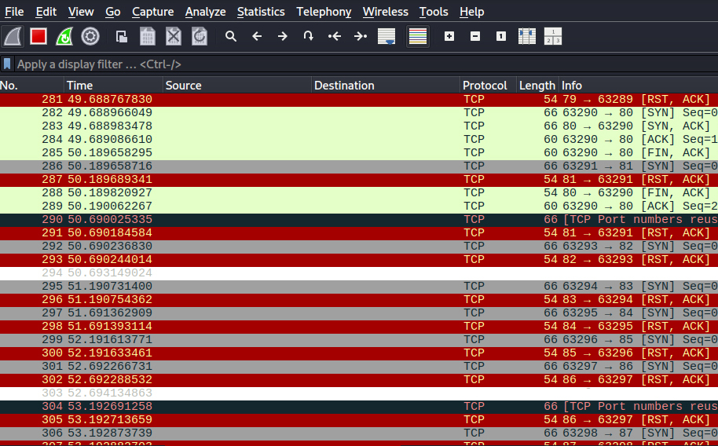

# Simple Port Scanner in Python

## Project Overview
This is a simple Python-based TCP port scanner designed to identify open ports on a target host and attempt basic service banner grabbing.

The project was created for learning purposes to better understand how network services behave, how TCP connections are established, and how basic reconnaissance works in cybersecurity.

---

## Learning Goals
- Understanding TCP connections and port states
- Learning how port scanning works at a low level
- Introduction to socket programming in Python
- Basic banner grabbing from open services
- Observing network behavior using packet analysis tools

---

## How It Works
The script attempts to establish TCP connections to ports in the range 1–1000.

For each port:
- A connection attempt is made using a TCP socket
- If the connection is successful, the port is considered **open**
- The script then attempts to read a service banner (if available)

---

## Example Output

This screenshot shows the output of the port scanner in the terminal.

The script iterates through ports 1–1000 and prints:
- Open ports detected via successful TCP connection
- Basic service banner information (when available)

This screenshot shows network traffic captured during a port scan using Wireshark.

- **Open port:** TCP connection is successfully established (SYN → SYN-ACK → ACK), indicating an active service listening on the target port.
- **Closed port:** Connection attempt is rejected with a  RST/ACK response, indicating that no service is running on the port.

Wireshark highlights many packets in red due to multiple TCP reset and failed connection events generated during rapid port scanning.

This visual representation reflects the intensive nature of port scanning and the large volume of short-lived TCP connections generated during the process.

---

## Key Concepts Demonstrated
- TCP connection establishment (3-way handshake)
- Port scanning using `connect_ex()`
- Timeout handling in network requests
- Banner grabbing from network services

---

## Technologies Used
- Python 3.14
- socket library

---

## Security Perspective
This project demonstrates basic reconnaissance techniques commonly used in network security:
- Identifying exposed services on a host
- Collecting service banners for further analysis

---

## ⚠️ Disclaimer
This tool is intended for educational purposes only and should only be used on systems you own or have explicit permission to test.
